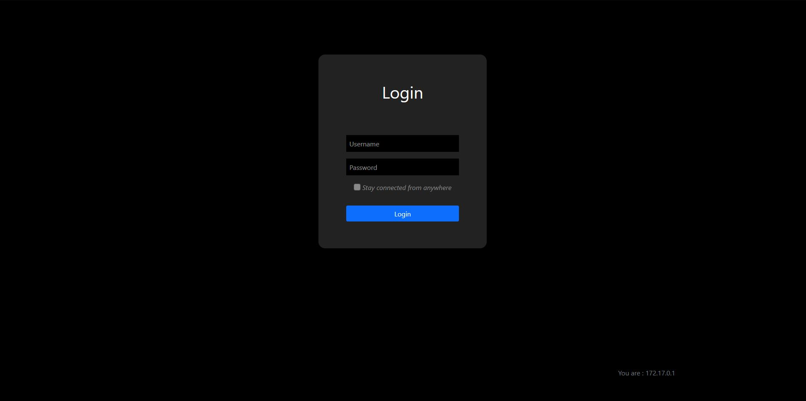

# GFA - go-forward-auth

Lightweight GO server acting as a "forward-auth" middleware (in Traefik for instance).

Inspired by [sohamkamani's tuto](https://github.com/sohamkamani/go-session-auth-example) many thanks to him.

Use at your own risk, not yet secured. Feel free to PR/Issue if you detect security issues :)

## Endpoints
- / for html rendering and forward-auth url 
  - return 401 and a "Login page" if no valid JWT and invalid credentials supplied
  - return 300 if no valid JWT and valid credentials supplied (means you logged-in succesfully)
  - return 300 and extend JWT if valid JWT near expiration date
  - return 200 and a "Welcome page" if valid JWT
- /logout to logout
  - return 302 (means you logged-out succesfully)

To log-in, credentials are supplied via Header "Auth-Form" (POST is not forwarded to middlewares by Traefik)
GFA check if the website is allowed for the user (cf. configuration file and Aud. in JWT)

## WIP
- ~~jwt instead of cookie and session~~
- ~~password saved as hash using bcrypt~~
- ~~ssl with selfsigned cert~~
- ~~choose config file from flag~~
- ~~automatic image push on docker hub (quentinb69/go-forward-auth)~~
- ~~pass header value such as username when valid JWT~~
- ~~automatic test~~
- ~~automatic lint (gofmt, etc...)~~
- ~~use CSRF ? (not sure if needed)~~
- help tool for bcrypt
- real documentation
- reacto for cleaner code

## Screenshot
The following screenshot shows the default login page.

## Release
Available as a docker image : [quentinb69/go-forward-auth](https://hub.docker.com/r/quentinb69/go-forward-auth)

## Devonline
- [Google Cloud Shell](https://shell.cloud.google.com/cloudshell/editor?cloudshell_git_repo=https://github.com/quentinb69/go-forward-auth.git)
- [Github.dev](https://github.dev/quentinb69/go-forward-auth/)

## License
The source code and binaries of GFA are subject to the MIT License.
